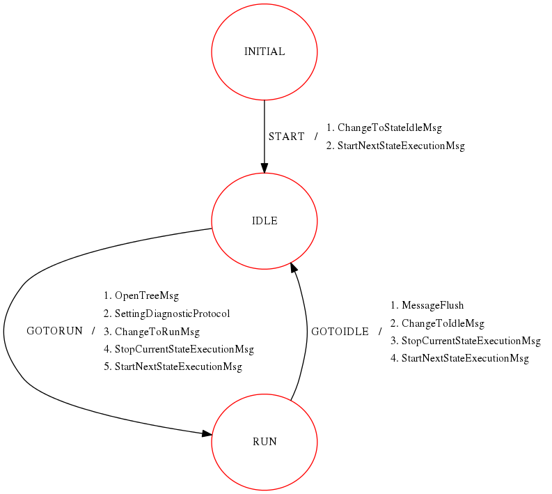
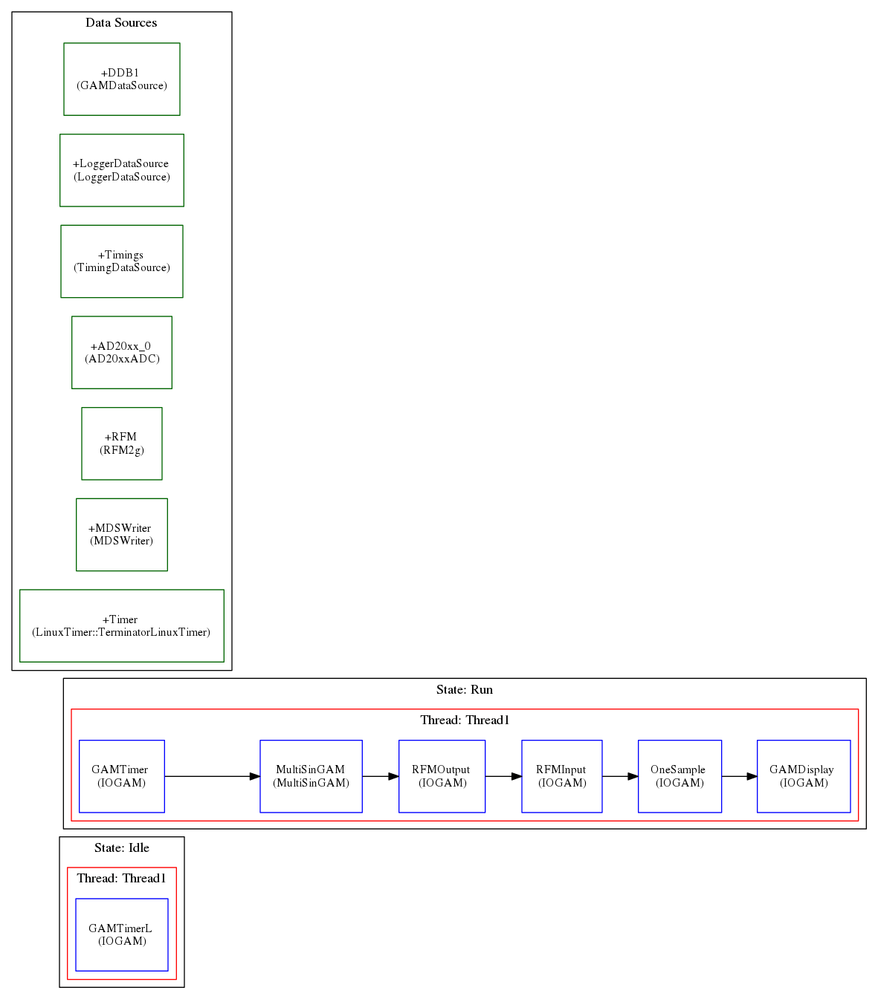
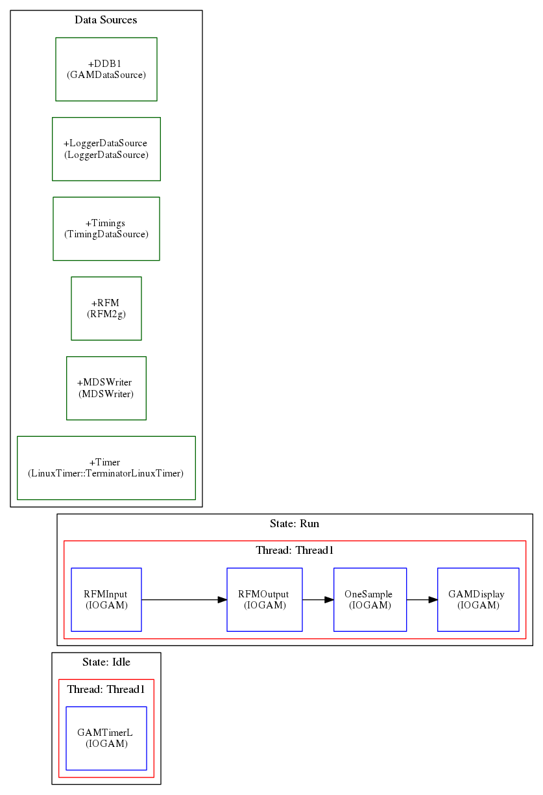
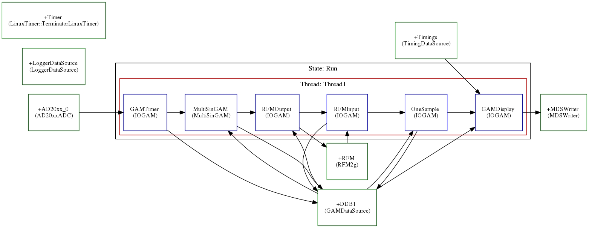
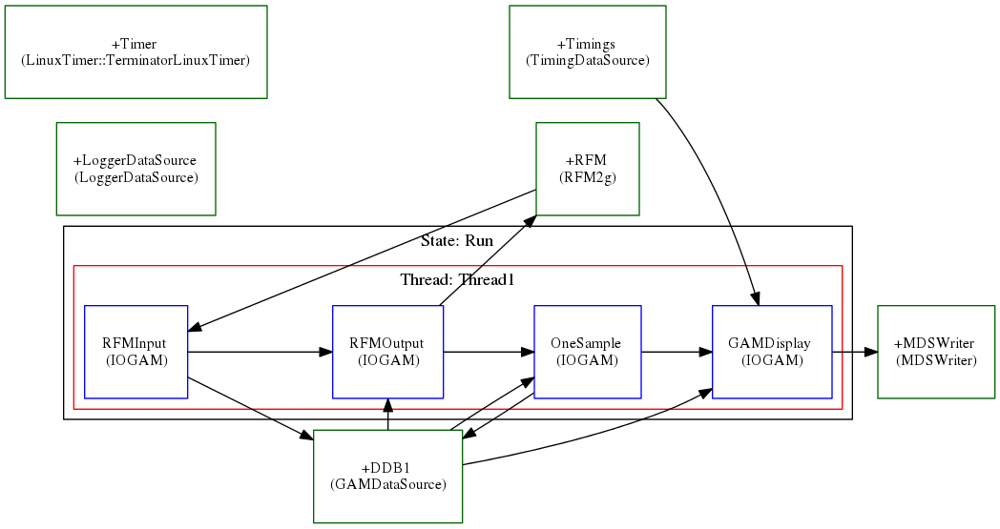

# RFM2gNoPollingConfigurations_Trees

The three_host folder contains Configurations and trees  for the Scenario A: 

"<b>ONE master synchronized by adlink 2020 adc and TWO slaves synchronized by Rfm<b>"

 
The StateMachines for master and slaves are the same and showed in figure  
 

 
The master and slaves MARTe2 RtApp(s) objects are summarized in the following two figures 
 

 
The master station in the state Run acts as follow:
 

 

 
The Slaves corresponding states acts as follow 
 

The change form Idle to Run State, issued by TcpProxy Message,  requires that all the hosts involved 
in the configurations  are up and running the Idle State.
More information about the RFM Datasource can be found [here](https://github.com/LucBonc/RFM2gNoPolling)

The four_host folder contains Configurations and trees  for the Scenario B: 

The four hosts example is constructed in this way:

-The master reads all the four hosts (NodeIdNumber: 0, 1, 2, 3)

-Host 1 and host 2 read the first three hosts (NodeIdNumber: 0, 1, 2, 3)

-Gost 3 reads all the four hosts (NodeIdNumber: 0, 1, 2, 3)

The configurations file are as follows:

-Master: master_ADC_two_threads47.cfg

-Host 2: slave253_two_threads47-Host.cfg

-Host 1 and host 4: slave47_two_threads47.cfg (on the same configuration file as two separate threads)
